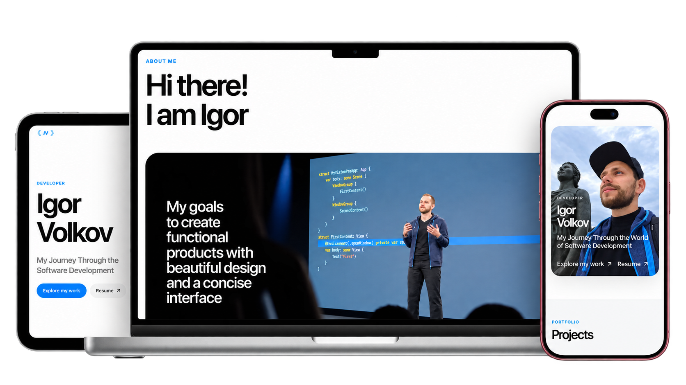

**English** | [Русский](README/README-RUS.md)



## About

[igorcodes.de](https://igorcodes.de) is my personal portfolio and a home for the projects I have built while growing as a software developer. The current version is a bilingual, responsive single-page application focused on presenting my experience, selected web and iOS projects, and the technologies I work with.

## Features

- English and Russian localization;
- responsive layouts for mobile and desktop screens;
- light and dark themes;
- SEO metadata and sitemap.

## Stack

- React 19;
- TypeScript 6;
- Vite 8;
- CSS Modules and custom CSS;
- Motion for interface animations;
- Liquid Gooey and Symbols React for interface effects and icons;
- Oxlint for static analysis.

## Deployment

The production build in `dist` is committed to the repository because the current Netcup Webhosting 1000 plan does not provide Node.js. A native Git pre-commit hook builds the site and stages the refreshed `dist` directory as part of the same commit. After a push, a GitHub webhook triggers Plesk, which publishes the contents of `dist` to `httpdocs`.

After cloning the repository on a new machine, enable the versioned hooks once:

```bash
git config core.hooksPath .githooks
```
