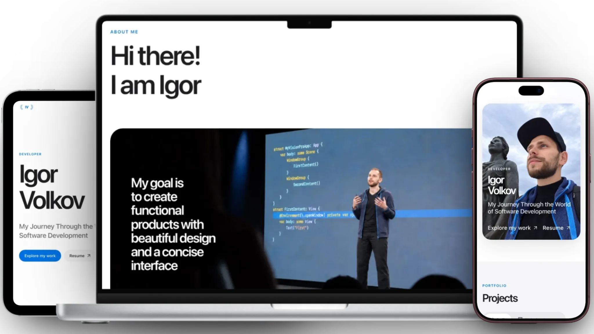

[🇬🇧 English version](../README.md)

## О проекте

[igorcodes.de](https://igorcodes.de) — моё личное портфолио и пространство для проектов, созданных по мере моего развития в разработке программного обеспечения. Текущая версия представляет собой двуязычное адаптивное одностраничное приложение, в котором собраны мой опыт, избранные веб- и iOS-проекты, а также технологии, с которыми я работаю.

## Возможности

- локализация на английском и русском языках;
- адаптивная вёрстка для мобильных и настольных экранов;
- светлая и тёмная темы;
- анимированные секции и галереи проектов;
- скачивание резюме;
- SEO-метаданные, карта сайта и аналитика Яндекс Метрики.

## Стек

- React 19;
- TypeScript 6;
- Vite 8;
- CSS Modules и собственные стили CSS;
- Motion для анимаций интерфейса;
- Liquid Gooey и Symbols React для визуальных эффектов и иконок;
- Oxlint для статического анализа.

## Деплой

Готовая сборка в `dist` хранится в репозитории, поскольку текущий тариф Netcup Webhosting 1000 не предоставляет Node.js. Нативный Git hook перед коммитом собирает сайт и добавляет обновлённую папку `dist` в тот же коммит. После отправки изменений GitHub webhook запускает Plesk, который публикует содержимое `dist` в `httpdocs`.

После клонирования репозитория на новом компьютере нужно один раз включить версионируемые hooks:

```bash
git config core.hooksPath .githooks
```
